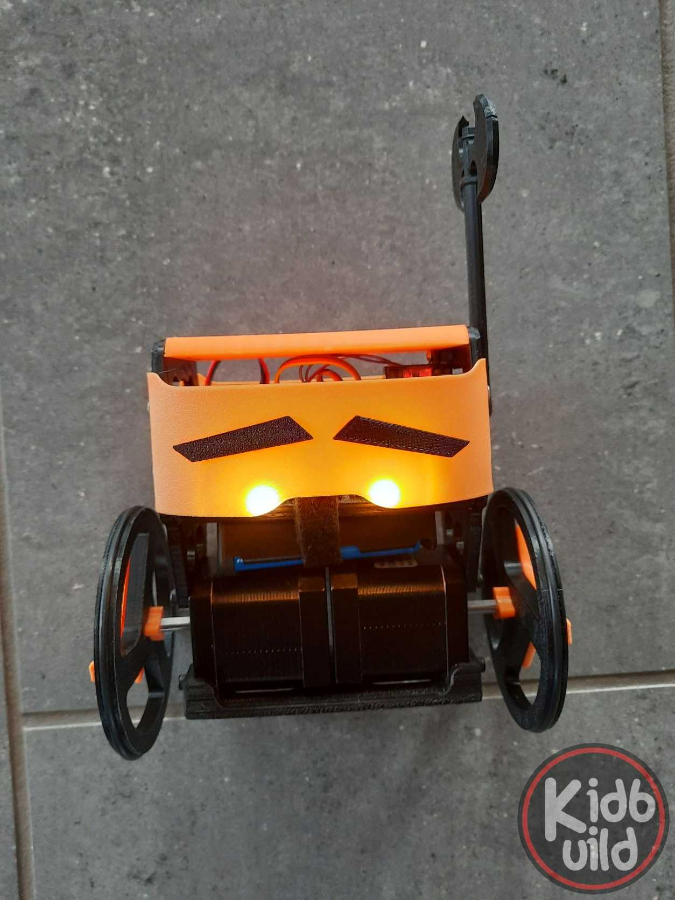
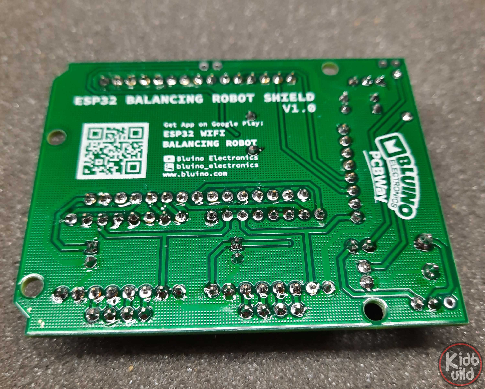
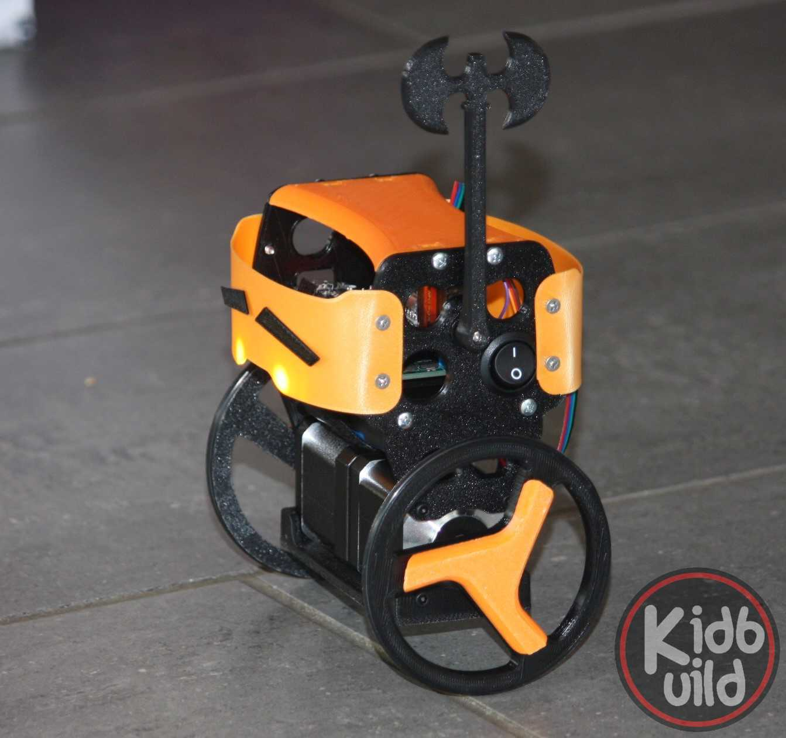
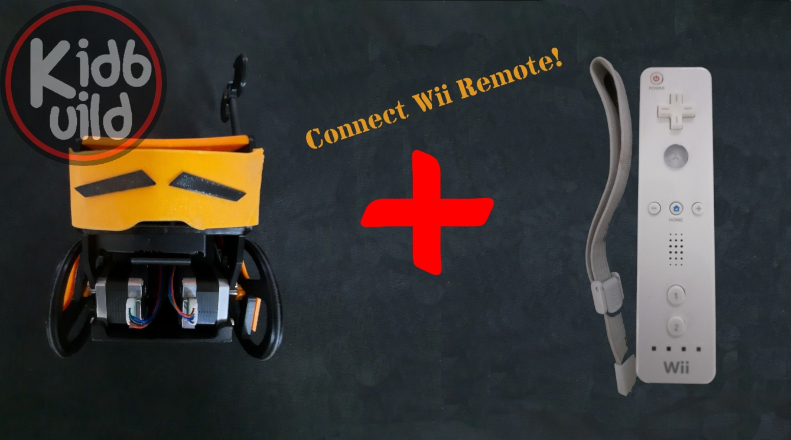

# Balance-robot Kidbuild 

## Description
Build your own balanced robot with this project. Based on jjrobots and bluino.com we present an 
open source balanced robot with enhanced features.

## Features
- The source is merged to the platformio enviroment.
- The project is open source. You can build up your own robot for free (only hardware costs).
- The project use standard hardware like stepper, driver, electronics. You can buy it as you like.
- Use the project for education!
- Control the robot via android app

## STL files for 3D printing
You will find all STL files and addons in the STL folder. Typically printed without support.
0.2mm thickness and 20% infill should work well.

## Electronic schematic

| Pin   | Function              |
|-------|-----------------------|
| 12    | Stepper A&B Enable    |      
| 26    | Stepper A STEP        |
| 25    | Stepper A DIR         |
| 14    | Stepper B STEP        |
| 27    | Stepper B DIR         |
| 13    | Servo                 |
| 21    | MPU-6050 SDA          |
| 22    | MPU-6050 SCL          |
| 32    | LED Light             |
| 33    | BUZZER                |

## HMTL commands

| Command Character 	|HTML command after IP/URL  |
|-----------------------|---------------------------|
| Forward               | /?fader1=1.00             |
| Backward              | /?fader1=0.00             |
| Turn Right            | /?fader2=0.00             |
| Turn Left             | /?fader2=1.00             |
| Servo Arm             | /?push1=1|2               |
| Beep On|Off   	    | /?push3=1|2               |
| Turn Light On|Off     | /?push4=1|0               |
| Mode PRO On|Off       | /?toggle1=1|0             |
| P-Stability           | /?fader3=0.00-1.00        |
| D-Stability           | /?fader4=0.00-1.00        |
| P-Speed               | /?fader5=0.00-1.00        |
| I-Speed               | /?fader6=0.00-1.00        |

## BOM

| Pieces | Description									|
|--------|----------------------------------------------|
| 1		 | PCB ESP32 Balancing Robot Shield				|
| 1		 | ESP32 DEVKIT V1 board 						|
| 2		 | Stepper Motor Driver A4988 					|
| 1		 | 3 axis Acc. and Gyro sensor MPU6050 			|
| 2		 | Stepper Motor Nema17 						|
| 1		 | Servo Motor MG90S/SG90						|
| 1		 | LED 3mm red									|
| 2		 | LED 3mm/5mm White Super Bright 				|
| 1		 | Active Buzzer 								|
| 2 	 | V-Regulator 5V AMS1117 SOT-223 (Kit is presoldered)	| 
| 1		 | Resistor 470 Ohm 								|
| 1		 | Capacitor 0.1uF 								|
| 1		 | Capacitor 100uF/16V rad.						| 	
| 2		 | Capacitor 220uF/16V rad.						|
| 1		 | Rocker Switch Dia. 20mm						| 
| 2		 | Rechargeable Battery Li-ion 18650 3,7V		| 
| 1 	 | Dual 18650 Battery Holder					|
| 1		 | Micro USB Cable (for programming)			|
| 1		 | Terminal Screw 2 pin 5mm 					|
| 2		 | Female Header 15 pin 						|
| 5		 | Female Header 8 pin 							|
| 2		 | Female Header 4 pin 							|
| 1		 | Male Header 2 pin 							|
| 1		 | Male Header 3 pin 							|
| 2		 | Male Header 4 pin 							|
| 1		 | Jumper cap 									|
| 2		 | O-ring 3mm ID 82mm							| 
| 8		 | M3x8 screw									| 
| 9		 | M3x10 screw									|
| 9      | M3 nut                                       |
| 12	 | self tapping screws 3mmx3mm					|

## Wii Remote control
- Connect the Wii-Remote by pressing button 1 + 2 in same time
- Wii is connected, if LED one on Wii lit
- Hold the controller horizontal
- Button 1 = piezo
- Button 2 = eyes
- Button A = servo
- Controll via gyro by pressing the B button

## How to flash

The easiest way to flash your Robot is to use the web flash tool.
Supported browser: Microsoft Edge or Google Chrome.
Follow this link for easy flashing: https://eisbaeeer.github.io/Balance-Robot_Kidbuild/flash/index.html

### Manual flashing
1. Donwload ESP flasher tool. E.g.: https://github.com/Jason2866/ESP_Flasher/releases
2. Download firmware.bin from release page: https://github.com/Eisbaeeer/Balance-Robot_Kidbuild/releases

## How to update via webUpdate
1. Connect to robot via Wifi
2. Open http://192.168.4.1/update
3. Upload firmware.bin from release page: https://github.com/Eisbaeeer/Balance-Robot_Kidbuild/releases 

## How to compile
1. Install VS-Code
2. Install addon platformio
3. clone repository
4. open repository in VS-Code
4. Compile

## Weblinks to get running
- http://www.kidbuild.de or https://shop.kidbuild.de
E-Mail info@kidbuild.de

## Changelog 

### Version 1.5
    Date: 20220819
    - Added passive buzzer support
    - Robot waiting 45 seconds for Wifi connection. After that the robot will disable Wifi and switch to Wii-remote bluetooth

### Version 1.4
    Date: 20220727
    - Added Wii-Remote as remote controller

### Verison 1.3
    Date: 20220703
    - Added OTA firmware web update
    - Optimized web control

### Version 1.2
	Date: 20220627
	- Added joystick via browser
	- Added background live view with esp32-camera
	- Added light, sound, servo control

### Version 1.0
    Date: 20220529
    Contributor: Kidbuild
    - Added Web control for any browser
    1. Connect to wifi of B-Robot
    2. Open browser at 192.168.4.1
    3. Take control via touch screen
    
